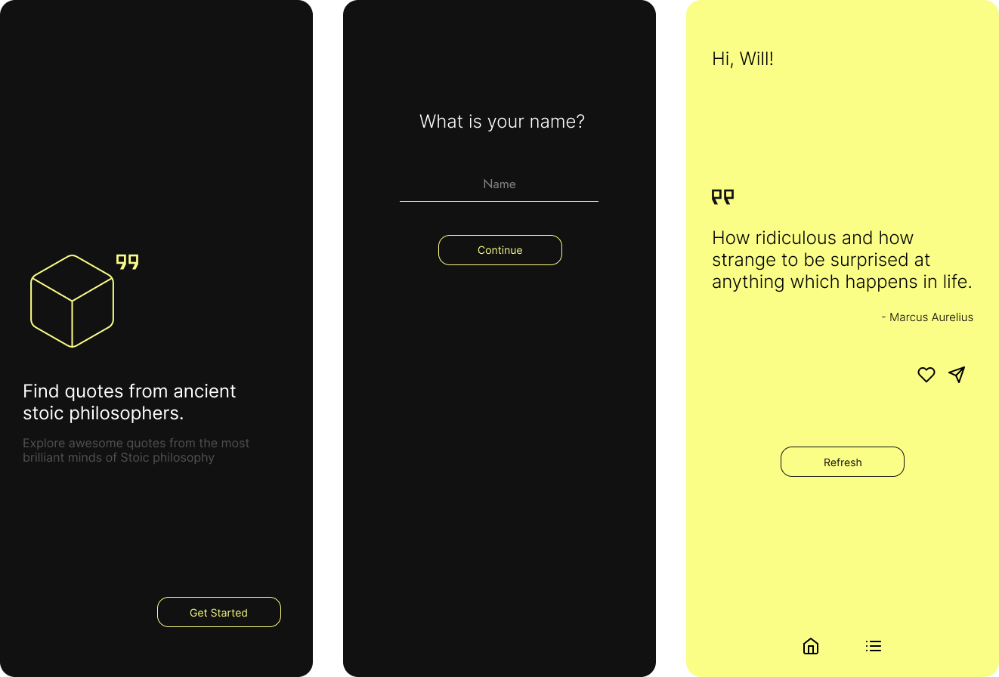

<div align="center" border-radius="100px">
  
</div>

##

Philosophy Quotes is a mobile app to show random quotes every time the user touch on refresh button.
In this project you'll find:

- User Interface built with Constraint Layout
- MVVM and SOLID concepts
- Local data store with Shared Preferences
- Dark and Light Mode
- HTTP Requests with Retrofit
- JSON Serialization with Gson
- Usage of [Stoic Quotes API](https://stoicquotesapi.com/)
- Shimmer loading effect
- Custom fonts from Google Fonts
- Share quote as a image preview
- Bottom navigation view with fragments

### Opening the project

Clone this repository in a terminal with

```
git clone https://github.com/WillACosta/philosophy_quotes
```

To build this project, use the `gradlew build` command or open with Android Studio and
use `Import Project`.

### Screenshots

<div style="margin: 0 auto">
    
</div>

---

Made with 🖤 by Will
