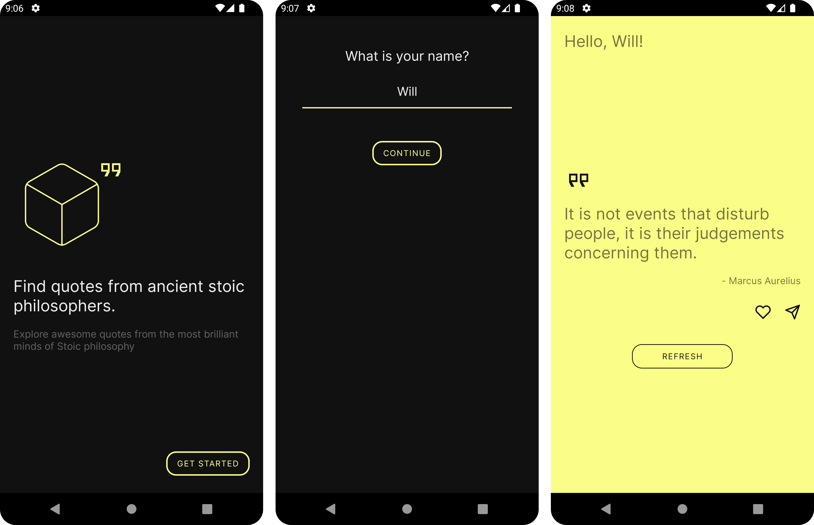

<h1 align="center">  </h1>

<p align="center">
  <a href="https://opensource.org/licenses/Apache-2.0"></a>
  <a href="https://medium.com/@willAmaral/arquitetura-android-moderna-utilizando-single-activity-pattern-e38aa658a129"></a>
  <a href="https://www.instagram.com/wiidev/"></a> 
</p>

Philosophy Quotes is a mobile app to show random quotes every time the user touch on refresh button.
In this project you'll find:

- Single Activity Pattern
- Fragment-based navigation
- Kotlin Coroutines and Flow
- Clean/MVVM architecture and SOLID concepts
- Dependency Injection with Koin
- User preferences data store with Shared Preferences
- Save favorites quotes in local database with ROOM

- Flexible State class. The app uses a flexible UiState<T> wrapper class capable of handling
  responses with type safety
- HTTP Requests with Retrofit
- JSON Serialization with Gson
- API consumption of [Stoic Quotes API](https://stoicquotesapi.com/)

- UI/UX modern interface using Google Material Design components and Constraint Layout
- Shimmer loading effect
- Custom fonts from Google Fonts
- Share quote as a image preview

### Opening the project

Clone this repository in a terminal with

```
git clone https://github.com/WillACosta/philosophy_quotes
```

To build this project, use the `gradlew build` command or open with Android Studio and
use `Import Project`.

### Screenshots

<div style="margin: 0 auto">
    
</div>

---

Made with 🖤 by Will
